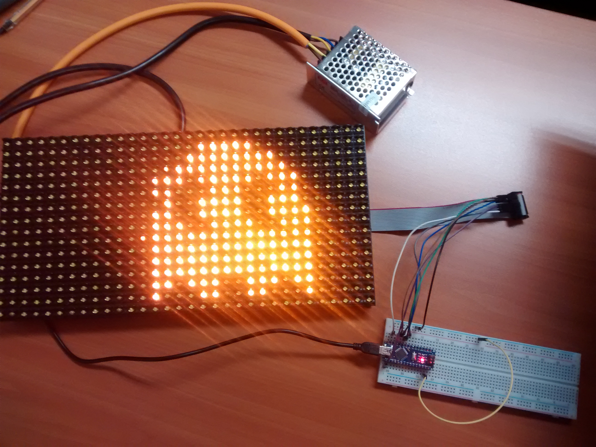
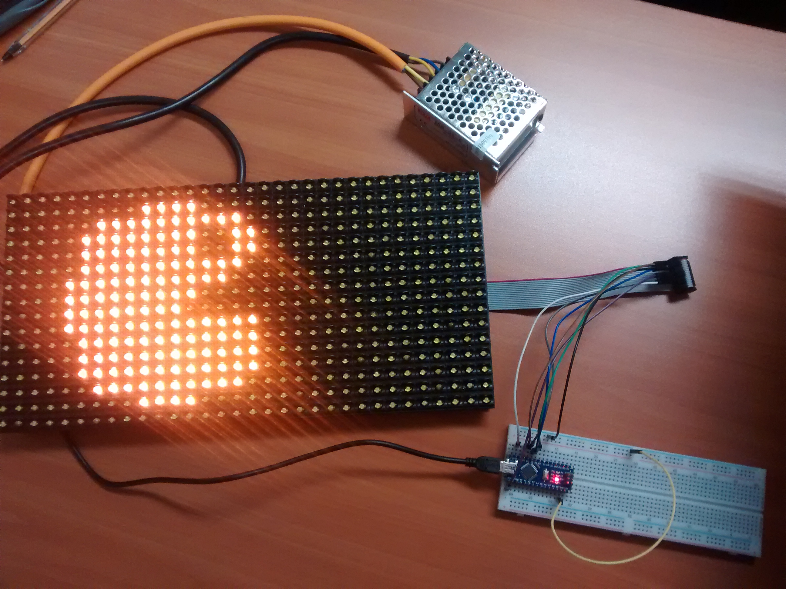

# Panel de LEDS de 32x16

## Objetivo ##
Presentar en un panel (P10) de 32x16 (512 leds) diferentes tipos de animaciones, tanto de texto como de imágenes.

## Referencias ##
- [Librería en GitHub](https://github.com/freetronics/DMD)
- [Descripción del Panel en Freetronics](http://www.freetronics.com.au/collections/display/products/dmd-dot-matrix-display-32x16-green)
- [Detalles de implementación](http://www.ediy.com.my/index.php/blog/item/116-arduino-driving-a-32x16-dot-matrix-display-panel)
- [Foro de Interés con notas relevantes](http://forum.freetronics.com/viewtopic.php?t=5754) Revisar el archivo DMD Notes.txt

## Conexiones ##

- Los pines numerados y las conexiones mostradas hacen referencia al conector trasero del panel ubicado en el costado izquierdo (visto desde atrás)
- Visto desde frente, el cable ribbon va conectado al conector de la derecha del panel y los pines se numeran según la imagen
- Al conectar el arduino se energizará el panel (diseño pobre)
- Por lo anterior se **DEBE** alimentar el panel de manera independiente con una fuente de 5V y al menos unos 3A. 
- Al conectar la alimentación al panel se energizará un poco el arduino (diseño pobre)
- Por lo anterior se **DEBEN** conectar todos los pines que corresponden y que están señalados en la imagen a GND

## Preparación del Entorno de Desarrollo
1. Los arduino nano que estamos utilizando tienen el chip CH340 para la conversión USB a Serial. Acorde a la página de [Instructable](http://www.instructables.com/id/Arduino-Nano-CH340/ "") se puede descargar el driver desde [aquí](http://www.wch.cn/download/CH341SER_ZIP.html). Seleccionar la plataforma apropiada a cada situación (en el caso de Linux no es necesario instalar)
2. En la IDE de Arduino y con el administrador de librería instalar la librería "TimerOne" (Sketch->Include Library->Manage Libraries... buscar TimerOne e instalar)
3. Descargar el ZIP de la librería DMD desde [aquí](https://github.com/freetronics/DMD) (Download ZIP)
4. Desde la IDE de Arduino y con el administrador de librería, instalar el ZIP recien descargado (Sketch->Include Library->Add .ZIP Library y seleccionar el archivo descargado en el punto anterior)
5. Configurar la IDE de Arduino con "Arduino NANO", "ATMega 328" (a menos que utilicen otra) y la puerta respectiva (en el caso de Windows recordar instalar el driver del CH340)
6. Probar el demo Files->Examples>DMD-master->dmd_demo

## Implementar la aplicación para la ExpoGame
Hemos dejado un sketch base que el alumno puede intervenir en DMD (DMD.ino) que, básicamente, despliega de izquierda a derecha un par de imágenes de 16x16 puntos monocromáticos.

Utilizar como apoyo los ejemplos que se instalaron junto a la librería DMD.

