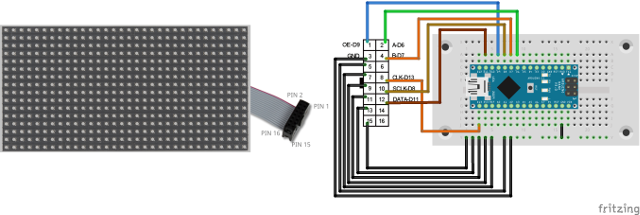

# Display de 32x16

https://github.com/freetronics/DMD
http://www.freetronics.com.au/collections/display/products/dmd-dot-matrix-display-32x16-green
http://www.ediy.com.my/index.php/blog/item/116-arduino-driving-a-32x16-dot-matrix-display-panel

1 En la IDE de Arduino y con el administrador de librería instalar la librería "TimerOne"

2 Descargar el ZIP de la librería DMD desde https://github.com/freetronics/DMD (DMD2 es aun beta)

3 Desde la IDE de Arduino y con el administrador de librería, instalar el ZIP recien descargado

4 Configurar la IDE de Arduino con "Arduino NANO" Y "ATMega 328" (a menos que utilicen otra)

5 Cagar el ejemplo para el panel desde Examples/DMD-Master/dmd_demo

6 Realizar las instalaciones del panel, cables acorde a los diagramas del directorio images/
Todos los pines GND deben ser conectados o el panel se alimentará desde los pines del arduino

7 Probar el demo

8

