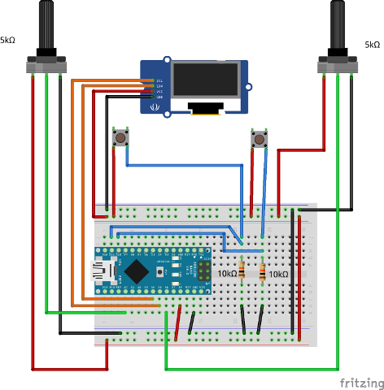

# Pong con Display OLED

## Objetivo ##
Construir una consola de juegos básica con un Arduino, 2 botones y 2 potenciómetros

## Referencias ##
- [Idea base tomada desde aquí](http://michaelteeuw.nl/post/87381052117/building-pong)
- [Arduino Monochrom Graphics Library for LCDs and OLEDs](https://github.com/olikraus/u8glib/wiki)


##Conexiones ##


- Notar que en Arduino Nano la línea SDA está en el pin A4 y  SCL está en A5

## Preparación del Entorno de Desarrollo
1. Los arduino nano que estamos utilizando tienen el chip CH340 para la conversión USB a Serial. Acorde a la página de [Instructable](http://www.instructables.com/id/Arduino-Nano-CH340/ "") se puede descargar el driver desde [aquí](http://www.wch.cn/download/CH341SER_ZIP.html). Seleccionar la plataforma apropiada a cada situación (en el caso de Linux no es necesario instalar)
2. En la IDE de Arduino y con el administrador de librería instalar la librería "U8glib" (Sketch->Include Library->Manage Libraries... buscar U8glib e instalar)
3. Configurar la IDE de Arduino con "Arduino NANO", "ATMega 328" (a menos que utilicen otra) y la puerta respectiva (en el caso de Windows recordar instalr el driver del CH340)
4. Probar algunos de los demos que trae la librería  quitando los comentarios a la línea
```U8GLIB_SSD1306_128X64 u8g(U8G_I2C_OPT_DEV_0 ...);```

## Implementar la aplicación para la ExpoGame
Hemos dejado un sketch base que el alumno puede intervenir (PongOled.ino) que, básicamente, corresponda a una versión básica del juego PONG


- Hubo que sacrificar los pines que aparecen en la parte de atrás del Arduino Nano


